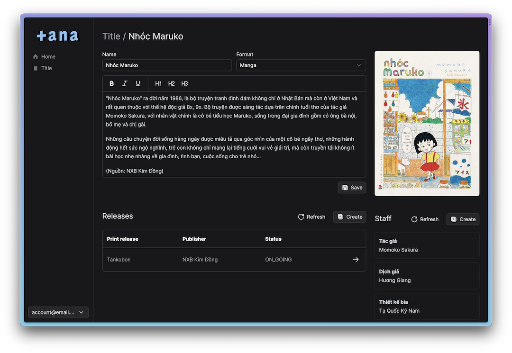

<p align="center">

</p>

<p align="center">
<a href="https://tana.moe/">Homepage</a> | <a href="https://blog.tana.moe/">Blog</a>
</p>

shinobu (oshino) is a Nuxt-based admin control panel use to manage [momoka-lite](https://github.com/tanamoe/momoka-lite).

Look at the [Nuxt 3 documentation](https://nuxt.com/docs/getting-started/introduction) to learn more.

## Get Started

<p align="center">

</p>

Define some required variable in the project `.env` file, include:

```
POCKETBASE_URL=
```

## Setup

Make sure to install the dependencies:

```bash
pnpm install
```

## Development Server

Start the development server on `http://localhost:3000`

```bash
pnpm run dev
```

## Production

Build the application for production:

```bash
pnpm run build
```

Locally preview production build:

```bash
pnpm run preview
```

Check out the [deployment documentation](https://nuxt.com/docs/getting-started/deployment) for more information.
